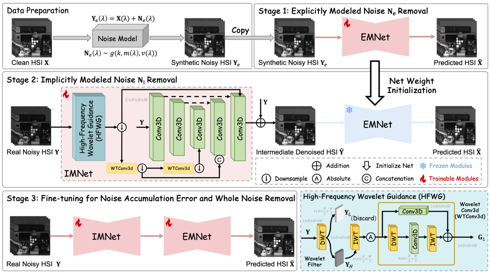

<p align="center">
  <h1 align="center">Real Noise Decoupling for Hyperspectral Image Denoising (Official)</h1>
  
  <p align="center">
    <a href="https://yingkai-zhang.github.io/">Yingkai Zhang</a>,  
    <a href="https://scholar.google.com/citations?user=BfbSy4oAAAAJ&hl=zh-CN&oi=ao">Tao Zhang</a>,
    <a href="https://github.com/yingkai-zhang/RND/">Jing Nie</a>,
    <a href="https://ying-fu.github.io/">Ying Fu</a>*.
      (*Corresponding author)
  </p>
  <h2 align="center">AAAI 2026</h2>

  <h3 align="center">
    <a href="https://github.com/yingkai-zhang/RND/" target='_blank'></a>
    <a href="https://ojs.aaai.org/index.php/AAAI/article/view/38291" target='_blank'></a>
    <a href="https://arxiv.org/abs/2511.17196" target='_blank'></a>
    <a href="https://huggingface.co/datasets/YingkaiZhang/MEHSI" target="_blank"></a>
  </h3>

</p>

This repository contains the official PyTorch implementation of "*Real Noise Decoupling for Hyperspectral Image Denoising*" accepted at **AAAI Conference on Artificial Intelligence (AAAI) 2026.**

## News :sparkles:

- [x] The code will be released soon.
- [x] 2026-02-03: The dataset [MEHSI](https://huggingface.co/datasets/YingkaiZhang/MEHSI) and its [README](./dataset/README.md) have been released.
- [x] 2025-11-21: Upload for [Arxiv](https://arxiv.org/abs/2511.17196).


## Overview

Real hyperspectral image (HSI) noise is produced by multiple physical and
unknown sources. Even carefully calibrated noise models cannot reproduce every
component accurately, creating a domain gap between synthetic and captured
HSIs. Directly learning the complex real-noisy-to-clean mapping from a limited
number of paired samples is therefore difficult.

RND addresses this problem with a multi-stage noise-decoupling framework. It
decomposes real noise into two complementary components:

1. **Explicitly modeled noise** that can be approximated by a calibrated
   physical noise model.
2. **Implicitly modeled noise** that contains fitting residuals and unknown
   noise sources not captured by the physical model.

By removing the two components in separate stages and then jointly fine-tuning
the complete model, RND reduces the learning difficulty while preserving both
spatial details and spectral fidelity.

<div align="center">
  
</div>

## MEHSI Dataset

We introduce the **Multi-Exposure Real HSI Denoising (MEHSI)** dataset to
support real-world HSI denoising under multiple noise levels. The data were
captured with an SOC710-VP hyperspectral camera at exposure times equal to
`1/20`, `1/50`, and `1/100` of the clean reference exposure.

- 101 indoor and outdoor scenes.
- 303 aligned noisy-clean HSI pairs.
- 34 spectral bands per HSI.
- Spatial resolution of `690 x 512` after processing.
- 273 pairs from 91 scenes for training.
- 30 pairs from 10 scenes for testing.
- Overlapping `128 x 128` crops for training.
- A center `512 x 512` crop for testing.

The clean HSIs are obtained by averaging captures. Paired samples are manually
aligned and calibrated. Download the dataset from
[Hugging Face](https://huggingface.co/datasets/YingkaiZhang/MEHSI).

The repository provides both pair-level and scene-level splits:

```text
dataset/
  README.md
  train.txt
  test.txt
  train_scene.txt
  test_scene.txt
```

Please refer to [dataset/README.md](./dataset/README.md) for additional details.

Note: In one of the test set scenes, the low-light image and the original image were not pixel-aligned; this has now been corrected, so the actual training and testing results will be slightly higher than those reported in the paper.

## Other Datasets

The paper also reports experiments on the following real paired datasets:

- [**RealHSI**](https://github.com/colintaozhang/hsidwrd): 59 noisy-clean pairs captured with an SOC710-VP camera, with 34
  bands spanning 400-700 nm and a spatial size of `696 x 520`. Following SERT,
  44 HSIs are used for training and 15 for testing.
- [**LHSI**](https://github.com/guanguanboy/HSIE): used to evaluate generalization across sensors, spectral
  resolutions, and acquisition conditions.

## Baselines and Code Resources

The paper compares RND with representative HSI denoising methods.

| Method | Venue | Year | Public code |
| --- | --- | ---: | --- |
| QRNN3D | IEEE TNNLS | 2020 | [GitHub](https://github.com/Vandermode/QRNN3D) |
| MAC-Net | IEEE TGRS | 2021 | [Github](https://github.com/bearshng/mac-net) |
| T3SC | NeurIPS | 2021 | [Github](https://github.com/inria-thoth/T3SC) |
| GRNet | IEEE TGRS | 2021 | [Github](https://github.com/xiangyongcao/GRN) |
| SST | AAAI | 2023 | [Github](https://github.com/MyuLi/SST) |
| SERT | CVPR | 2023 | [Github](https://github.com/MyuLi/SERT) |
| HSDT | ICCV | 2023 | [Github](https://github.com/Zeqiang-Lai/HSDT) |
| TDSAT | IEEE TGRS | 2024 | [Github](https://github.com/Featherrain/TDSAT) |
| HIRDiff | CVPR | 2024 | [Github](https://github.com/LiPang/HIRDiff) |
| VolFormer | CVPR | 2025 | [Github](https://github.com/yudadabing/VolFormer) |
| RND (Ours) | AAAI | 2026 | [Github](https://github.com/yingkai-zhang/RND) |

RND is a general framework rather than a backbone-specific design. The paper
validates it with TDSAT, HSDT, and VolFormer as explicitly modeled noise removal
networks.

## Setting

### 1. Clone the Repository

```shell
git clone https://github.com/yingkai-zhang/RND.git
cd RND
```

### 2. Prepare the Data

Download MEHSI from [Hugging Face](https://huggingface.co/datasets/YingkaiZhang/MEHSI)
and use the provided text files under `dataset/` for the official train/test
splits.

### 3. Training

EMNet Pretraining:

```shell
python hside_real_noiseknow_ratio.py -a rnd -p RND_TDSAT_NoiseKnown -t --rootdir ./dataset --val_epoch 5 -b 2 --loss charbonnier  --repeat 1
```

IMNet Pretraining:

```shell
python hside_real_noiseunknow_ratio_release.py -a rnd -p RND_TDSAT_NoiseUnKnown -t --rootdir ./dataset --val_epoch 5 -b 1 --loss-num 3 --loss charbonnier_kl_sam --pretrain --pretrainPath ./result/rnd/RND_TDSAT_NoiseKnown/ckpt/model_best.pth --repeat 1
```

Joint Finetuning:

```shell
python hside_real_noiseunknow_ratio_release.py -a rnd -p RND_TDSAT_NoiseUnKnown_finetune -t --rootdir ./dataset --val_epoch 5 -b 1 --loss-num 3 --loss charbonnier_kl_sam -r -rp ./result/rnd/RND_TDSAT_NoiseUnKnown/ckpt/model_epoch_40_10920.pth --repeat 1
```

### 4. Inference and Evaluation

```shell
python hside_real_noiseunknow_ratio_release_test.py -a rnd -p RND_TDSAT_test -r -rp ./result/rnd/RND_TDSAT/ckpt/model_epoch_400_109200.pth --rootdir ./dataset
```

The example checkpoint can be downloaded [Here](https://drive.google.com/drive/u/0/folders/1-uvK8Evqoapj0XSGrTMD5VrmkH6gFuhi).


## Citation

If you find our work useful for your research, please consider citing the following paper

```bibtex
@inproceedings{zhang2026real,
  title={Real Noise Decoupling for Hyperspectral Image Denoising},
  author={Zhang, Yingkai and Zhang, Tao and Nie, Jing and Fu, Ying},
  booktitle={Proceedings of the AAAI Conference on Artificial Intelligence},
  volume={40},
  number={15},
  pages={12925-12933},
  year={2026}
}
```

## Acknowledgments

The codes are based on [SERT](https://github.com/MyuLi/SERT) and [HSDT](https://github.com/Zeqiang-Lai/HSDT). We thank the authors for their valuable contributions.